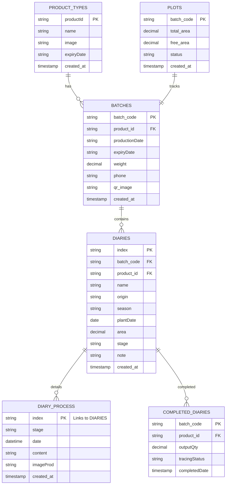

```sql
-- Create database
CREATE DATABASE htx_traceability;
USE htx_traceability;

-- Product Types
CREATE TABLE product_types (
    productId VARCHAR(10) PRIMARY KEY,
    name VARCHAR(100) NOT NULL,
    image VARCHAR(255),
    expiryDate VARCHAR(50),
    created_at TIMESTAMP DEFAULT CURRENT_TIMESTAMP
);

-- Batches
CREATE TABLE batches (
    batch_code VARCHAR(20) PRIMARY KEY,
    product_id VARCHAR(10),
    productionDate DATE,
    expiryDate DATE, 
    weight DECIMAL(10,2),
    phone VARCHAR(20),
    qr_image TEXT,
    created_at TIMESTAMP DEFAULT CURRENT_TIMESTAMP,
    FOREIGN KEY (product_id) REFERENCES product_types(productId)
);

-- Plots
CREATE TABLE plots (
    batch_code VARCHAR(20) PRIMARY KEY,
    total_area DECIMAL(10,3),
    free_area DECIMAL(10,3),
    status VARCHAR(50) DEFAULT 'active',
    created_at TIMESTAMP DEFAULT CURRENT_TIMESTAMP,
    FOREIGN KEY (batch_code) REFERENCES batches(batch_code)
);

-- Diaries
CREATE TABLE diaries (
    index VARCHAR(20) PRIMARY KEY,
    batch_code VARCHAR(20),
    product_id VARCHAR(10),
    name VARCHAR(100),
    origin VARCHAR(100),
    season VARCHAR(50),
    plantDate DATE,
    area DECIMAL(10,2),
    stage VARCHAR(50),
    note TEXT,
    created_at TIMESTAMP DEFAULT CURRENT_TIMESTAMP,
    FOREIGN KEY (batch_code) REFERENCES batches(batch_code),
    FOREIGN KEY (product_id) REFERENCES product_types(productId)
);

-- Diary Process
CREATE TABLE diary_process (
    id INT AUTO_INCREMENT PRIMARY KEY,
    index VARCHAR(20),
    stage VARCHAR(50),
    date DATETIME,
    content TEXT,
    imageProd VARCHAR(255),
    created_at TIMESTAMP DEFAULT CURRENT_TIMESTAMP,
    FOREIGN KEY (index) REFERENCES diaries(index)
);

-- Completed Diaries
CREATE TABLE completed_diaries (
    batch_code VARCHAR(20) PRIMARY KEY,
    product_id VARCHAR(10),
    outputQty DECIMAL(10,2),
    tracingStatus VARCHAR(50),
    completedDate TIMESTAMP,
    FOREIGN KEY (batch_code) REFERENCES batches(batch_code),
    FOREIGN KEY (product_id) REFERENCES product_types(productId) 
);
```